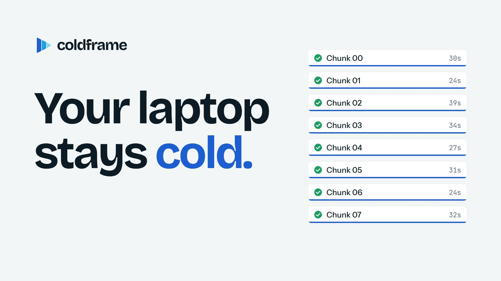
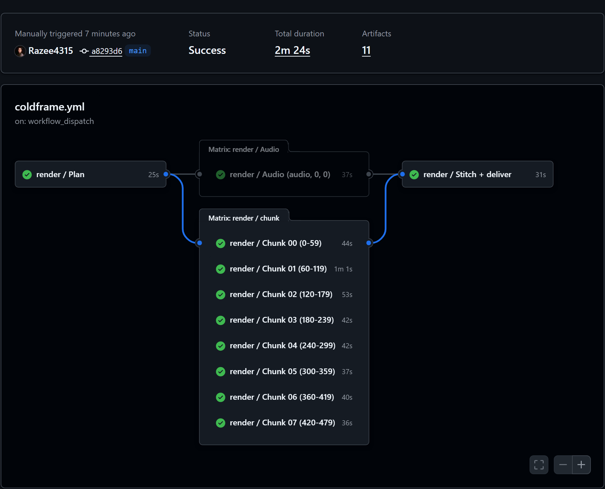
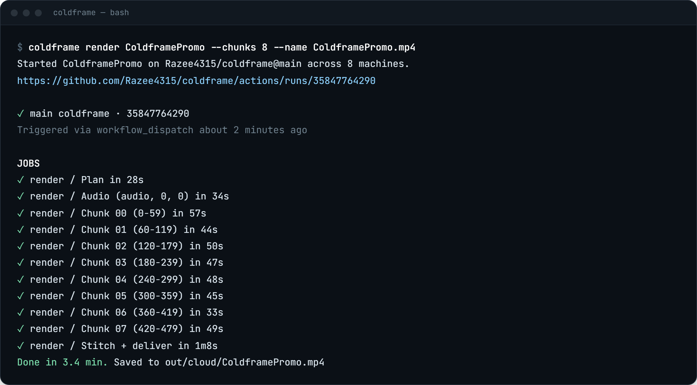

<p align="center">
  
</p>

<h1 align="center">coldframe</h1>

<p align="center">
  <b>Render Remotion videos in the cloud. Your laptop stays cold.</b><br>
  Free GitHub machines render your video in parallel, every frame is checked, and the MP4 comes back to you.
</p>

<p align="center">
  <a href="https://razee4315.github.io/coldframe/">Website</a> ·
  <a href="#setup">Setup</a> ·
  <a href="#google-drive-optional">Google Drive</a> ·
  <a href="#video-rules">Video rules</a> ·
  <a href="#faq">FAQ</a>
</p>

<p align="center">
  <a href="docs/media/launch-film.mp4"></a><br>
  <a href="docs/media/launch-film.mp4"><b>▶ Watch the launch film</b></a> (56 s), rendered by coldframe on 12 GitHub machines
</p>

---

## What it does

Rendering a [Remotion](https://www.remotion.dev) video ties up your computer: fans on, everything slow, nothing else gets done. coldframe hands the render to free GitHub machines instead:

1. **Split:** your video is cut into equal pieces.
2. **Render:** up to 20 GitHub machines each render one piece, all at the same time.
3. **Stitch:** the pieces are joined without re-encoding, every frame is counted, and the MP4 comes back to your computer (and to Google Drive, if you want).

The [launch film](docs/media/launch-film.mp4) above and the [demo on the website](https://razee4315.github.io/coldframe/) ([MP4](docs/media/demo.mp4)) are Remotion projects in [`example/`](example), rendered by coldframe on GitHub machines (12 and 8).

<p align="center">
  
  
</p>

## Setup

You need a Remotion project on your computer and [Node.js](https://nodejs.org) 18 or newer.

**1. Install the GitHub CLI**, then open a new terminal:

| Windows | macOS | Linux |
|---|---|---|
| `winget install GitHub.cli` | `brew install gh` | [cli.github.com](https://cli.github.com) |

**2. Run setup in your project folder.** It walks you through everything and asks before it creates anything:

```bash
npx github:Razee4315/coldframe setup
```

- signs you in to GitHub (you paste a code in your browser)
- puts your project on GitHub if it isn't there yet
- adds the render workflow and the Claude Code skills
- optionally connects Google Drive

**3. Render.** Use the `id` of your Remotion `<Composition>`. The MP4 lands in `out/cloud/`.

```bash
npx github:Razee4315/coldframe render MyVideo
```

That's it. The cloud renders what's **pushed** to GitHub, and coldframe warns you if you have unpushed changes.

## Google Drive (optional)

Save every render to `My Drive/coldframe/`. No password or key is copied anywhere: you sign in to Google in your browser.

1. Install rclone, the tool that uploads to Drive: `winget install Rclone.Rclone` (Windows) or `brew install rclone` (macOS).
2. In your project folder, run:
   ```bash
   npx github:Razee4315/coldframe drive
   ```
3. A Google page opens. Pick your account and click **Allow**.

coldframe asks only for access to files it creates itself (Google's `drive.file` permission), not the rest of your Drive. The sign-in is saved as a secret in your GitHub repo.


## Video rules

Setup adds three skills to your project, so Claude Code follows them whenever it makes a video:

- [video-rules](.claude/skills/video-rules/SKILL.md): story structure, the "AI look" to avoid, text, UI, data, CTA, length and formats.
- [motion-direction](.claude/skills/motion-direction/SKILL.md): how to direct and build real motion design in Remotion: a virtual camera, depth planes, match cuts and palette impacts, and a workflow of three directions → beat sheet → approved styleframes before anything is animated.
- [sound-design](.claude/skills/sound-design/SKILL.md): a soft music bed, a real sound for every click, keystroke and transition, mixing levels, and an audio sample you approve before the full render. Setup also adds a [library of 37 CC0 sound effects](sfx/LICENSE.md) to `public/sfx/` and `<Sfx>` / `<MusicBed>` helpers to `src/coldframe-sound.tsx`.

The short version:

| Don't | Do |
|---|---|
| Open with a logo | Spend the first 3 seconds on the problem or the result |
| Default dark + glow + purple, particles | Your real brand colours and fonts |
| The same fade between every scene | Mix transitions, each with a reason |
| Make everything bounce | One emphasis technique, on the word that matters |
| Tiny text, lots of it | 7 words or fewer per screen, readable on a phone |
| Numbers you haven't measured | Real, sourced numbers |
| Flat slides fading in | A camera, depth, one real product action with a held result |
| Silence, or beeps made in code | Soft music and a real sound for every action |


## Honest numbers

Measured on a laptop with 4 cores / 8 threads.

| | Laptop | coldframe on GitHub |
|---|---|---|
| The 20 s demo (600 frames, 1080p30) | 46 s | 1 min 53 s on 8 machines ([run](https://github.com/Razee4315/coldframe/actions/runs/35863387579)) |
| Your computer while it renders | Busy, fans on | Free, can even be off |
| 3D scenes (WebGL / three.js) | Uses your GPU | No GPU, drawn in software: much slower |

Each machine spends about 40 s getting ready, so **short videos are still quicker at home**. coldframe is for when you need your computer while a video renders, and for long videos made of text, UI, images and footage. For 3D-heavy videos, render the 3D shots once on your own GPU and use them as clips.

## CLI

```text
coldframe setup                     one-time setup in your Remotion project (start here)
coldframe render <Comp> [options]   render in the cloud, wait, download the MP4
coldframe drive                     also save every render to Google Drive
coldframe runs                      list recent cloud renders
coldframe init                      only add the GitHub workflow file

  --chunks <n>      parallel machines (default 8, max 20)
  --props <json>    input props
  --ref <branch>    git ref to render (default: current branch)
  --out <dir>       where to save the MP4 (default out/cloud)
  --name <file>     output file name
  --no-wait         start the render and exit
```

You can also start a render from your repo's **Actions** tab → **coldframe** → **Run workflow**.

## Workflow inputs

`setup` adds [`.github/workflows/coldframe.yml`](templates/coldframe.yml), which calls the shared [render workflow](.github/workflows/render.yml). Edit it to change these:

| Input | Default | What it does |
|---|---|---|
| `composition` | (required) | Composition id to render |
| `chunks` | `8` | Parallel machines, 1–20 |
| `project-dir` | `.` | Folder with the Remotion `package.json` |
| `props` | `{}` | Input props as JSON |
| `output-name` | `<comp>-<run>.mp4` | Name of the final file |
| `gl` | `swangle` | Chrome's OpenGL backend. `swangle` runs WebGL on machines without a GPU |
| `frame-timeout` | `120000` | Milliseconds one frame may take (heavy 3D needs more than Remotion's default) |
| `concurrency` | `100%` | Remotion `--concurrency` on each machine |
| `extra-args` | | Extra flags for every `remotion render`, e.g. `--crf=16` |
| `drive-folder` | `gdrive:coldframe` | Where renders go in Drive, when Drive is connected |

Your project needs a committed `package-lock.json`. coldframe adds the Linux binaries that npm often leaves out of lockfiles made on Windows or macOS ([npm/cli#4828](https://github.com/npm/cli/issues/4828)).

## FAQ

**Is it free?** Yes. On public repos, GitHub machines are free with no limit. Private repos get 2,000 free machine-minutes a month, and each machine counts separately (8 machines × 3 min = 24 min). If you run out, GitHub stops the job. You're never charged unless you add a payment method.

**Will the joins show?** No. Each frame is rendered on its own, the video pieces are joined without re-encoding, and each piece carries its audio as lossless PCM, so the soundtrack joins sample-exactly (tested: 768,000 of 768,000 samples identical to a single-pass render). If the final frame count is wrong, the run fails instead of giving you a broken file.

**Does WebGL / three.js work?** Yes, and it looks the same as a GPU render, but it's slow on GitHub's machines. See the honest numbers above.

**Why not Remotion Lambda?** Lambda is faster and built for production, but needs AWS and costs money per render. coldframe is for free renders from a plain GitHub repo.

**What about Remotion's license?** coldframe is MIT. Remotion itself is free for individuals and companies of up to 3 people; larger companies need a [company license](https://www.remotion.pro/license).

## Repository layout

```text
bin/coldframe.mjs              the CLI (no dependencies, uses gh)
.github/workflows/render.yml   the shared parallel render workflow
templates/coldframe.yml        what setup adds to your project
.claude/skills/coldframe/      Claude Code skill: how to render in the cloud
.claude/skills/video-rules/    Claude Code skill: how to make videos that don't look AI-made
.claude/skills/motion-direction/ Claude Code skill: camera, depth, transitions, styleframes-first workflow
.claude/skills/sound-design/   Claude Code skill: music bed, a sound for every action, loudness
sfx/                           CC0 sound-effect library (setup copies it to public/sfx/)
templates/sound.tsx            <Sfx> and <MusicBed> helpers (setup copies it to src/coldframe-sound.tsx)
example/                       the Remotion demo project
docs/                          the website (GitHub Pages)
```

## License

[MIT](LICENSE). Not affiliated with Remotion, GitHub or Google.
