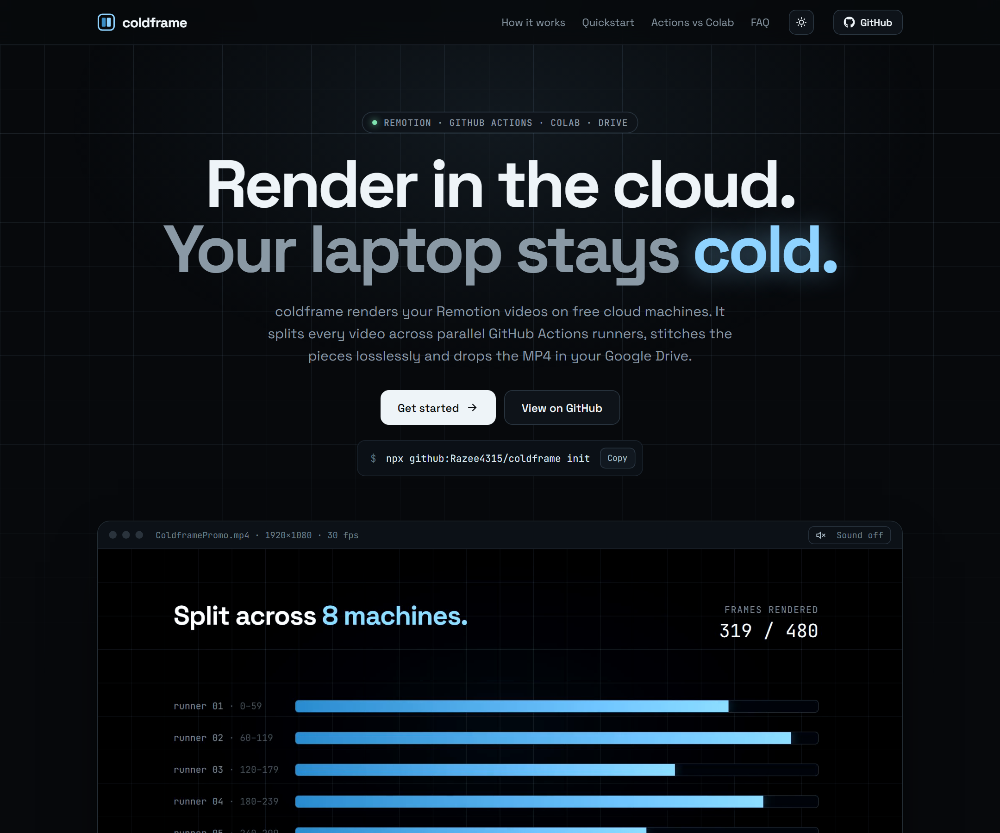
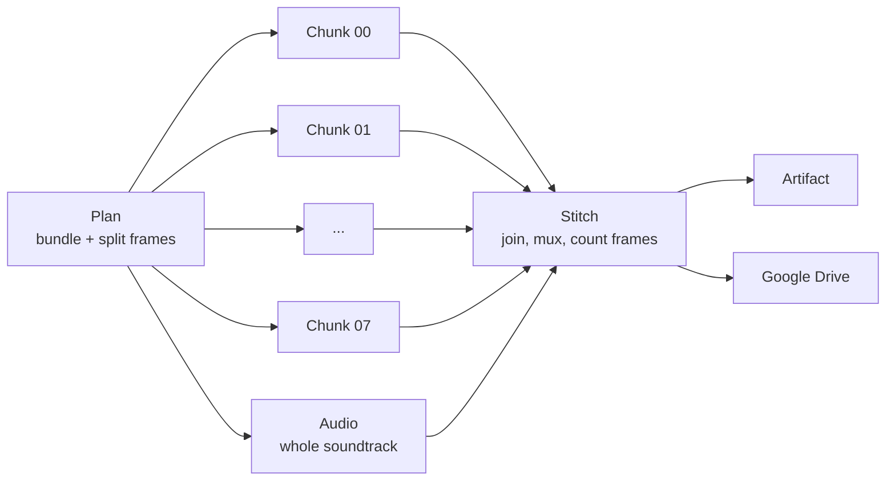

<p align="center">
  
</p>

<h1 align="center">coldframe</h1>

<p align="center">
  <b>Render Remotion videos in the cloud. Your laptop stays cold.</b><br>
  Parallel renders on free GitHub Actions runners · Google Colab via MCP · delivery to Google Drive
</p>

<p align="center">
  <a href="https://razee4315.github.io/coldframe/">Website</a> ·
  <a href="#quickstart">Quickstart</a> ·
  <a href="https://colab.research.google.com/github/Razee4315/coldframe/blob/main/colab/coldframe.ipynb">Open in Colab</a> ·
  <a href="#faq">FAQ</a>
</p>

<p align="center">
  <a href="https://razee4315.github.io/coldframe/"></a>
</p>

---

Rendering a long [Remotion](https://www.remotion.dev) video ties up your computer for minutes: fans at full speed, everything else slow. coldframe moves that work to free cloud machines:

- **Split:** the timeline is cut into frame ranges and rendered on up to **20 GitHub Actions runners at the same time**.
- **Stitch:** the pieces are joined without re-encoding, the soundtrack is rendered once in one piece, and **every frame is counted** before the run passes.
- **Deliver:** the MP4 is attached to the run, copied to **Google Drive** (optional), and downloaded to your PC by the CLI.
- **Colab:** a notebook and helper for Google Colab that **Claude Code can drive** through Google's [Colab MCP server](https://github.com/googlecolab/colab-mcp).

The [demo video on the website](https://razee4315.github.io/coldframe/) ([MP4](docs/media/demo.mp4)) was made with Remotion ([`example/`](example)) and rendered by coldframe on 8 runners.

## How it works



<p align="center">
  
  
</p>
<p align="center"><sub>A real run of the demo: every chunk renders on its own machine at the same time, and one command starts it, waits and downloads the result.</sub></p>

## Quickstart

You need a Remotion project in a GitHub repo, Node 18+ and the [GitHub CLI](https://cli.github.com) signed in (`gh auth login`).

**1. Add the workflow** (run in your Remotion project root, then commit and push):

```bash
npx github:Razee4315/coldframe init
git add .github && git commit -m "Add coldframe" && git push
```

This adds [`.github/workflows/coldframe.yml`](templates/coldframe.yml), a short file that calls coldframe's shared [render workflow](.github/workflows/render.yml).

**2. Render in the cloud:**

```bash
npx github:Razee4315/coldframe render MyComp --chunks 8
```

It starts the run, waits for it, and saves the MP4 to `out/cloud/`. You can also start a render from your repo's **Actions** tab → **coldframe** → **Run workflow**.

**3. Optional: deliver to Google Drive.** Sign in to Google once with [rclone](https://rclone.org/drive/) (name the remote `gdrive`), then store the config as a repo secret:

```bash
rclone config
gh secret set RCLONE_CONF < "$(rclone config file | tail -1)"
```

Every render is then also copied to `My Drive/coldframe/`.

## CLI

```text
coldframe init                      add the render workflow to this Remotion repo
coldframe render <Comp> [options]   render in the cloud, wait, download
coldframe runs                      list recent cloud renders

  --chunks <n>      parallel machines (default 8, max 20)
  --props <json>    input props
  --ref <branch>    git ref to render (default: current branch)
  --out <dir>       where to save the MP4 (default out/cloud)
  --name <file>     output file name
  --no-wait         start the render and exit
  --repo <o/r>      GitHub repo (default: the repo in this folder)
```

The cloud renders what is **pushed**. The CLI warns you about unpushed commits and uncommitted changes.

## Workflow inputs

Use the reusable workflow directly if you want full control:

```yaml
jobs:
  render:
    uses: Razee4315/coldframe/.github/workflows/render.yml@v1
    with:
      composition: MyComp
      chunks: 12
    secrets: inherit
```

| Input | Default | What it does |
|---|---|---|
| `composition` | (required) | Composition id to render |
| `chunks` | `8` | Parallel machines, 1–20 |
| `project-dir` | `.` | Folder with the Remotion `package.json` |
| `entry-point` | auto | Remotion entry file |
| `props` | `{}` | Input props as JSON |
| `output-name` | `<comp>-<run>.mp4` | Name of the final file |
| `gl` | `swangle` | Chrome OpenGL backend. `swangle` runs WebGL / three.js on CPU-only runners |
| `concurrency` | `100%` | Remotion `--concurrency` on each machine |
| `extra-args` | | Extra flags for every `remotion render`, e.g. `--crf=16` |
| `min-frames-per-chunk` | `60` | Never split finer than this |
| `drive-folder` | `gdrive:coldframe` | rclone destination, used when `RCLONE_CONF` is set |
| `node-version` | `22` | Node.js version |

Your project needs a committed `package-lock.json`. coldframe also adds Linux binaries that npm often leaves out of lockfiles made on Windows or macOS ([npm/cli#4828](https://github.com/npm/cli/issues/4828)).

## Google Colab

[`colab/coldframe.ipynb`](colab/coldframe.ipynb) renders on a Colab runtime and saves to Google Drive. [`colab/coldframe_colab.py`](colab/coldframe_colab.py) runs every step in the background and returns within seconds, so it also works inside the Colab MCP server's 30-second tool timeout:

```python
!curl -fsSL https://raw.githubusercontent.com/Razee4315/coldframe/main/colab/coldframe_colab.py -o coldframe_colab.py
import coldframe_colab as cf
cf.gpu()                          # what machine did we get?
cf.setup("you/your-video")        # clone + install in the background (2-4 min)
cf.status()                       # poll until "ready"
cf.render("MyComp")               # render in the background
cf.status()                       # poll until "done"
cf.to_drive("coldframe")          # My Drive/coldframe/MyComp-....mp4
```

For a private repo, add a Colab secret named `GITHUB_TOKEN` (key icon in the sidebar) and allow the notebook to read it.

## Claude Code

This repo includes a [Claude Code skill](.claude/skills/coldframe/SKILL.md) and an [MCP config](.mcp.json) for Google's Colab server. To use them in your own Remotion repo:

```bash
mkdir -p .claude/skills/coldframe
curl -fsSL https://raw.githubusercontent.com/Razee4315/coldframe/main/.claude/skills/coldframe/SKILL.md -o .claude/skills/coldframe/SKILL.md
claude mcp add colab-mcp -- uvx git+https://github.com/googlecolab/colab-mcp
```

Then ask Claude to render your video in the cloud. It checks a few low-res frames locally, pushes, renders on Actions (or Colab), and checks the result before handing it over.

## Benchmarks

Measured, not estimated. Laptop: Intel i7-7820HQ, 4 cores / 8 threads.

| Video | Laptop | coldframe |
|---|---|---|
| 16 s demo, 480 frames, 1080p30 | **57 s** | about 2.5 min on 8 machines ([run](https://github.com/Razee4315/coldframe/actions/runs/35850865828)) |
| 88 s launch film, 5,280 frames, 1080p60, three.js 360° scenes | 12–20 min | {{BIG}} |

Each machine spends about 40 s getting ready (checkout, cached `npm ci`, downloading the bundle), so **short clips are still faster at home**. The longer and heavier the video, the more the split pays off. And either way, your computer is free while it renders.

## FAQ

**Is it free?** On public repos, GitHub Actions minutes on standard runners are free. Private repos get 2,000 free minutes a month, and every machine counts: 8 chunks × 3 min = 24 min.

**Will the joins show?** No. Remotion renders each frame on its own, chunks are joined without re-encoding, and the audio is rendered once for the whole video. In the demo, the change between frames across a join is the same size as ordinary frame-to-frame motion, and a wrong frame count fails the run.

**Does WebGL / three.js work?** Yes, through SwiftShader (`--gl=swangle`). It's slower than a GPU, which is exactly why splitting the work helps.

**Why not Remotion Lambda?** Lambda is faster and made for production, but needs AWS and costs money per render. coldframe is for free renders from a plain GitHub repo.

**Are my files private?** Your project stays in your own repo, so use a private repo for confidential footage. Chunk artifacts are deleted after a day. The final MP4 stays on the run (90 days by default) and in your Drive.

**Remotion's license?** coldframe is MIT. Remotion itself is free for individuals and companies of up to 3 people; larger companies need a [company license](https://www.remotion.pro/license).

## Repository layout

```text
.github/workflows/render.yml   the reusable distributed render workflow
.github/workflows/coldframe.yml  renders example/ (same inputs as the template)
templates/coldframe.yml        what `coldframe init` adds to your repo
bin/coldframe.mjs              the CLI (no dependencies, uses gh)
colab/                         Colab notebook + background helper
.claude/skills/coldframe/      Claude Code skill
.mcp.json                      Colab MCP server config
example/                       the Remotion demo project
docs/                          the website (GitHub Pages)
```

## License

[MIT](LICENSE). Not affiliated with Remotion, GitHub or Google.
